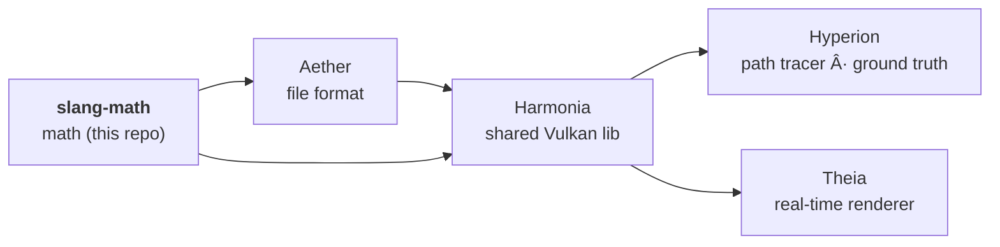

# AGENTS.md — slang-math

Quick-start context for AI agents so basic facts don't have to be rediscovered each session.

**Outstanding work, governance (definition of done + guardrails) and release history: see
[`PLAN.md`](PLAN.md).**

## What this repo is

**slang-math** is a standalone, **header-only C++20** math library shared by the four-repo
rendering pipeline. It provides the vector / matrix / quaternion types and free functions used
by both host-side C++ and (by naming parity) Slang/HLSL shaders.

Pipeline (dependency direction):


```mermaid
flowchart LR
    SM["<b>slang-math</b><br/>math (this repo)"] --> A["Aether<br/>file format"]
    A --> H["Harmonia<br/>shared Vulkan lib"]
    SM --> H
    H --> Hy["Hyperion<br/>path tracer · ground truth"]
    H --> T["Theia<br/>real-time renderer"]
```

Consumed via CMake **FetchContent** (`GIT_TAG vX.Y.Z`). Downstream builds override the pin with
`-DFETCHCONTENT_SOURCE_DIR_SLANG_MATH=<path-to-slang-math>` to test local changes
against unpushed tags.

## Core design decision — row-major storage

Matrices are stored **row-major** (rows contiguous), matching Slang/HLSL's native `float4x4`
layout. `m[row][col]` indexing is identical to Slang. Upload `value_ptr(m)` / `&m` directly to a
`row_major float4x4` GPU buffer — **no transpose**. `M * v` == Slang `mul(M, v)` (column-vector);
`v * M` == `mul(v, M)` (row-vector).

## Naming conventions (enforced — do not regress)

- **One canonical name per operation. NO aliases.** Do not re-add `mix`, `mat3`, `mat4_cast`,
  `toMatrix`, `lookAtRH`, `perspectiveRH_ZO`, `inverseLookAtRH`, `inversePerspectiveRH_ZO`, etc.
- **Align to the Slang/HLSL intrinsic spelling** where one exists: `dot`, `cross`, `normalize`,
  `length`, `lerp`, `clamp`, `reflect`, `transpose`, `inverse`, `radians`/`degrees`.
- **Casts use `toFloatNxN`:** `toFloat3x3(float4x4)`, `toFloat4x4(quaternion)`.
- **Quaternion is `(x, y, z, w)`; identity `{0,0,0,1}`** (matches Slang `float4`, NOT glm wxyz).
  Algebra: `dot`, `normalize`, `conjugate`, `operator*` (Hamilton, composes rotations), `slerp`.
- **Single coordinate convention → no `RH`/`ZO` suffix.** Only right-handed + Vulkan zero-to-one
  depth is shipped, so `lookAt` / `perspective` (+ `inverseLookAt` / `inversePerspective`) carry
  no suffix.

## Type-set policy

slang-math is a **complete, consistent, standalone** package — not just the subset the
pipeline currently consumes. Ship the full set for every supported scalar:

- float vectors: `float2/3/4` · integer vectors: `uint2/3/4` · square matrices: `float2x2/3x3/4x4`.
- **Free functions are generic over C++20 concepts** (`functions.hpp`): `vec` (any component
  vector — `float2/3/4` AND `uint2/3/4`, element-agnostic) carries the type-agnostic ops
  `dot`, `min`, `max`, `clamp`, `value_ptr`; `float_vec` (refines `vec`, `value_type == float`)
  carries the real-valued ops `length`, `normalize`, `lerp`, `abs`, `sqrt`, `exp`, `cos`, `log`,
  `pow`, `distance`, `reflect`; `square_mat` (`float2x2/3x3/4x4`) carries `transpose` and
  matrix×matrix `operator*`. No float3-only special cases — a new scalar's vectors inherit the
  `vec` ops automatically.
- **Sized integers only** — use `std::int32_t` / `std::uint32_t` (never bare `int`/`unsigned`)
  for stored members, dimensions (`static constexpr std::int32_t size`), and index/signature
  types. Vector elements keep their natural width (`float`; `uint32_t` for `uintN`).
- **When a new scalar type is first needed (e.g. signed `int`), add the FULL set at once**
  (`int2`, `int3`, `int4`) — never ship a scalar with a partial vector set
  (no `int2`+`int4` without `int3`).
- Matrix `transpose` and matrix×matrix `operator*` are generic over `square_mat`
  (`float2x2/3x3/4x4`); `inverse` stays size-specialized (closed-form 2×2, Cramer 3×3,
  Gauss-Jordan 4×4) — do not collapse to a single generic inverse.

## Layout of the headers

`include/slang-math/`: `float2/3/4.hpp`, `uint2/3/4.hpp`, `float2x2.hpp`, `float3x3.hpp`,
`float4x4.hpp`, `quaternion.hpp`, `functions.hpp` (free functions), `transform.hpp`
(camera/projection builders), `slang-math.hpp` (umbrella). Add à-la-carte includes to the
umbrella when introducing a new header.

## Build & test

```powershell
cmake -S . -B build -G Ninja -DCMAKE_BUILD_TYPE=Release `
      -DCMAKE_C_COMPILER=clang-cl -DCMAKE_CXX_COMPILER=clang-cl
cmake --build build
ctest --test-dir build --output-on-failure
```

Equivalent preset flow (Ninja + Release + clang-cl, no vcpkg — header-only, no deps):
`cmake --preset win` / `cmake --build --preset win` / `ctest --preset win`.

**Static analysis:** `python tools/check_tidy.py` — parallel clang-tidy over
`build/compile_commands.json`, classified per `.clang-tidy`'s WarningsAsErrors contract
(clang-diagnostic/clang-analyzer/bugprone fail the run; modernize/performance/portability
are report-only). Also registered as ctest `test_tidy` (label `analysis`; the fast test loop is `ctest -LE analysis`; skips when
clang-tidy, Python3 or the database is missing). Sanitizer lane (Clang/GCC configures only):
`-DSLANGMATH_SANITIZER=address|undefined|thread`. Host-side FP is deterministic
(`/fp:strict` / `-ffp-contract=off -fno-fast-math`).

Tests (`tests/test_slang_math.cpp`, GoogleTest via FetchContent) are the contract: every function
should have a round-trip or identity test. Add a test alongside any new function.

## Conventions

- Commit, but do **not** push unless asked.
- Header-only: no `.cpp`, no external dependencies. Keep it `constexpr`-friendly where practical.
- API additions are a minor version bump; breaking renames coordinate with downstream repos
  (migrate all call sites in Aether/Harmonia/Hyperion/Theia in the same change).
