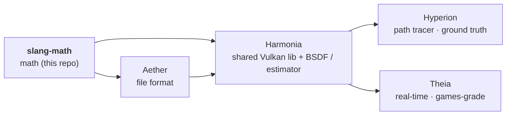

# PLAN — slang-math

**Living source of truth for outstanding work.** Shipped items are removed from the work
lists; the shipped record is the *Baseline* below and `git log`. Only outstanding work is
tracked here.

**How to read this plan** — *human / PM:* *How to continue* is the prioritized next-up list.
*AI agent picking up work:* read `AGENTS.md` (orientation, enforced conventions) → *How to
continue* (your task) → *Governance* (definition of done + guardrails) **before editing**.

## Context

slang-math is the header-only C++20 math substrate of a five-repo rendering pipeline:

The family's goal is OpenPBR 1.1.1 as the single material standard, with Theia converging to
Hyperion's unbiased ground truth. slang-math's part: a complete, consistent, standalone
math package with Slang/HLSL naming parity (see `AGENTS.md` for the enforced policies).
Sibling plans: `Aether/PLAN.md`, `Harmonia/PLAN.md`, `Hyperion/PLAN.md`, `Theia/PLAN.md`
in the sibling clones.

## At a glance

- **Release:** v0.2.1 (tag-synced with GitHub).
- **Next:** SM1–SM5, shipped as **one release (v0.3.0)** — see below.

## How to continue

### slang-math function-parity track (SM)

Close the gap between slang-math and the HLSL/Slang intrinsic vocabulary it mirrors, per this
repo's "complete, consistent, standalone package" type-set policy (AGENTS.md). Grounded in
downstream evidence: shader `saturate` has 99 call sites vs ~35 hand-rolled
`std::clamp(x,0,1)` host sites plus a local `clamp01()`
(`Harmonia/src/harmonia/pipeline/SceneOutputCopyPass.cpp:36`); shader `isfinite` has 29 sites
and Harmonia carries a dead hand-rolled `Math::isNanOrInf`
(`Harmonia/src/harmonia/utils/Math.hpp:39`); `cos` is the only trig function shipped, so
downstream runs per-component `std::sin`/`std::cos`/`std::atan2` code
(`Theia/src/theia/renderer/CameraController.hpp`, `IblProbe.cpp`, `Light.cpp`); `rsqrt` is
hand-mirrored as `1/std::sqrt` in three spots (`Hyperion/tests/unit/test_bsdf.cpp:489`,
`Harmonia/tests/unit/test_math.cpp:71`). Library comparison: glm-parity items are folded into
SM3/SM4 (`determinant` 4×4, `toQuaternion`, `ortho`, `trs`); DirectXMath's SIMD focus is out
of scope by design (slang-math is header-only and constexpr-friendly).

| ID | Task | Deps | Status |
|----|------|------|--------|
| SM1 | **Common-function batch** — `saturate`, `sign`, `floor`/`ceil`/`round`/`trunc`/`frac`/`fmod`, `rsqrt`, `fma`, `isnan`/`isinf`/`isfinite` (vec), `exp2`/`log2`/`log10`, per-component `pow(V,V)`, `step`, vector `smoothstep` (today scalar-only) — all in `functions.hpp`. | — | backlog |
| SM2 | **Trig + geometric completion** — `sin`/`tan`/`asin`/`acos`/`atan`/`atan2` (vec), `faceforward`, `refract` (zero-vector-on-TIR). | — | backlog |
| SM3 | **Matrix/quaternion completeness** — `determinant(float4x4)` (cofactor expansion; 2×2/3×3 exist), `v*M` row-vector ops for `float2x2`/`float3x3` (float4x4 has it, `float4x4.hpp:70`), `toFloat3x3(quaternion)` (symmetry with `toFloat4x4`), `toQuaternion(float3x3)` (Shepperd's method; TRS-decompose prerequisite for the family's animation track). | — | backlog |
| SM4 | **Transform builders** — `trs(t, q, s)` compose (the `Harmonia/src/harmonia/scene/Geometry.cpp:97` T·R·S pattern; feeds the node-hierarchy work NH2 in Harmonia/PLAN.md), `ortho` + `inverseOrtho` (RH ZO depth, symmetric with the `perspective`/`inversePerspective` pair). | — | backlog |
| SM5 | **Docs + release** — AGENTS.md `float_vec` enumeration refresh, version 0.2.1 → **0.3.0** (minor bump, API additions), test-per-function per the repo contract, `verify-full` clean. *(README refresh — types/functions tables, test count — already done.)* | SM1–SM4 | backlog |
| SM6 | **Downstream migration** (post-tag) — replace hand-rolled downstream code with the new functions (saturate sites, dead `Math::isNanOrInf`, duplicate `kPi` constants, `IblProbe` hand-rolled `Mat3` → `sm::float3x3`, `Geometry.cpp` TRS → `sm::trs`, test-mirror `rsqrt`/`saturate` cleanup). **Owned by the downstream repos** — Aether/Harmonia/Hyperion/Theia each carry their slice in their own PLAN.md; this repo's part ends at tagging v0.3.0. | SM5, v0.3.0 tag | backlog |

SM1–SM5 ship as **one release (slang-math v0.3.0)** — the split is for readability, not
sequencing; SM6 is the deliberate follow-up (deferred by scope decision, 2026-08-05: the
implementation session stays inside slang-math).

**Design decisions (locked):** naming = HLSL/Slang spelling (`frac`, `fma`, `rsqrt` — never
the glm `fract`/`inversesqrt`; no aliases per the repo's one-canonical-name rule). Scalar
overloads only where `std::` has no equivalent (`saturate`, `sign`, `frac`, `rsqrt`) — scalar
floor/round/trig stay with `std::`, matching the existing `abs`/`sqrt`/`cos` vector-only
precedent and avoiding `using namespace` ambiguity. Vector ops are `float_vec`-generic
(float2/3/4 inherit automatically). `isnan`/`isinf` return true if **any** component matches;
`isfinite` true only if **all** components are finite (validation semantics; vector-only).
Documented edge semantics: `sign(0) == 0`; `frac(x) = x − floor(x)`; `fmod` truncated (sign
follows dividend); `round` half away from zero; `refract` returns the zero vector on TIR;
`toQuaternion` requires an orthonormal rotation matrix.

## Governance

**Definition of done (per change):** `ctest` green **+** warning-clean build (strict
warnings-as-errors: clang-cl `/W4 /WX /permissive- /Zc:__cplusplus`, Clang/GNU
`-Wall -Wextra -Werror -Wpedantic`; a compiler warning is a build failure — fix the cause,
never silence it). Every new function carries a round-trip or identity test (repo contract).
**Per release:** the above plus `verify-full` (verify + format-check + clang-tidy + cppcheck).

**Guardrails:**

- Naming conventions and the type-set policy in `AGENTS.md` are enforced — do not regress.
- API additions are a minor version bump; breaking renames coordinate with downstream repos
  (migrate all call sites in Aether/Harmonia/Hyperion/Theia in the same change).
- Fix bugs at once — root-caused and patched in the same session. Deferral is not an
  acceptable resolution for a known defect.
- Solve directly, never defer: divergences are root-caused and fixed in code, not
  documented away.
- Tags are always pushed to GitHub — after any local tag, verify `git ls-remote --tags
  origin` == `git tag -l`. slang-math tags **first** in the family release order
  (slang-math → Aether → Harmonia → Theia/Hyperion); downstream repos bump their
  FetchContent `GIT_TAG` pins in their own release commits.
- Commit per-repo; push only on explicit OK.
- Living document — done work is removed from this file; the record is the Baseline and
  `git log`.

## Baseline

- **v0.2.1** (current): generic vector operators (`template<vec V>`) from the family-wide
  code-health pass; consumed by all four downstream repos.
- **v0.2.0**: the established type set (float2/3/4, uint2/3/4, float2x2/3x3/4x4, quaternion),
  row-major layout, RH+ZO-only transform builders.
- Earlier history in `git log`.
